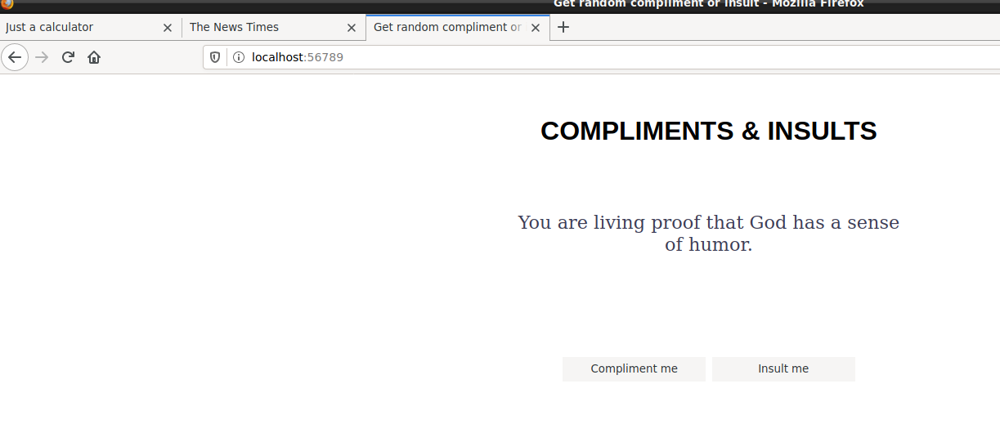

# Compliments & Insults

> **Info: https://github.com/juliospau/intro-to-web-dev**

## Components

- **1: Page index**

```html
<!DOCTYPE html>
<html lang="en">
<head>
    <meta charset="UTF-8">
    <meta name="viewport" content="width=device-width, initial-scale=1.0">
    <meta http-equiv="X-UA-Compatible" content="ie=edge">
    <title>Get random compliment or insult</title>

    <link rel="stylesheet" href="public/main.css">
</head>
<body>
    <main>
        <h1>Compliments & Insults</h1>
        
        <div class="text-paragraph">
            <p class="text"></p>
        </div>
        <div class="buttons">
            <button class="request-compliments">Compliment me</button>
            <button class="request-insults">Insult me</button>
        </div>

        <script src="./public/compliments.js"></script>
        <script src="./public/insults.js"></script>
       
     
        <script src="server.js"></script>
    </main>
</body>
```

- **2: server.js**

```javascript
const express = require("express");
const path = require("path");


const compliments = [
  "You like nice today",
  "That dress looks nice on you",
  "Have you been working out?",
  "You can do hard things",
  "You've gotten far in this course. You're really smart",
  "You're programming! How cool is that?",
  "I'm really proud of you",
  "You made this",
  "You've learned a lot of things, and that's pretty hard to do"
];

const insults = [
  "You fear success, but really have nothing to worry about.",
  "You are proof that evolution CAN go in reverse.",
  "Brains aren't everything. In fact in your case they're nothing.",
  "I love what you've done with your hair. How did you get it to come out of one nostril like that?",
  "You are so old, the candles on your birthday cake raised earth's temperature by 3 degrees.",
  "Is your name Maple Syrup? It should be, you sap.",
  "You're so dumb, your dog teaches you tricks.",
  "You are living proof that God has a sense of humor.",
  "You stare at frozen juice cans because they say, \"concentrate\"."
];

function getRandomCompliment() {
  const randomIndex = Math.floor(Math.random() * compliments.length);
  return compliments[randomIndex];
}
function getRandomInsult() {  // From the elements on the 'insults' object, returns a random insult
  const randomIndex = Math.floor(Math.random() * insults.length);
  return insults[randomIndex];
}

const app = express(); // Generates the server's skeleton(?

app.get("/", function(req, res) { // When the root dir is requested, the server responds with the index.html file
  res.sendFile(path.join(__dirname, "index.html"));
});


app.get("/compliments", function(req, res) {
  res
    .json({
      compliment: getRandomCompliment()
    })
    .end();
});

app.get("/insults", function(req, res) {
  /* When the button 'Insult me' is pressed, a new .json file is generated and inside that file 
  the server will give the insult element the randomly generated insult*/
  res
    .json({
      insult: getRandomInsult()
    })
    .end();
});


app.use("/public", express.static("./public"));
app.listen(49110);
console.log("Listening on http://localhost:49110");
```

- **3: Dockerfile**

```dockerfile
FROM node:current-buster-slim
WORKDIR /home/node/
COPY index.html .
COPY public/ ./public/
COPY server.js .
COPY README.md .
RUN npm init -y; npm install express
CMD ["node", "server.js"]
```

## Steps to create the container

- **1: Generate the image**

```bash
docker build . -t serv-img
```

- **2: Generate the container**

```bash
docker run --name server-cont -dit -p 56789:49110 serv-img
```

## Steps followed to get the server run

**From the root dir of the project:**

> **Generate the package.json, the file that contains info to be used about the project: `npm init -y`**

> **Install Express, the framework used to built the skeleton of the server: `npm install express`**

> **Run the server: `node server.js`**

## Results



---

> **Insults copied and pasted from [Dumb](http://www.dumb.com/insults/ "Dumb insults")**
