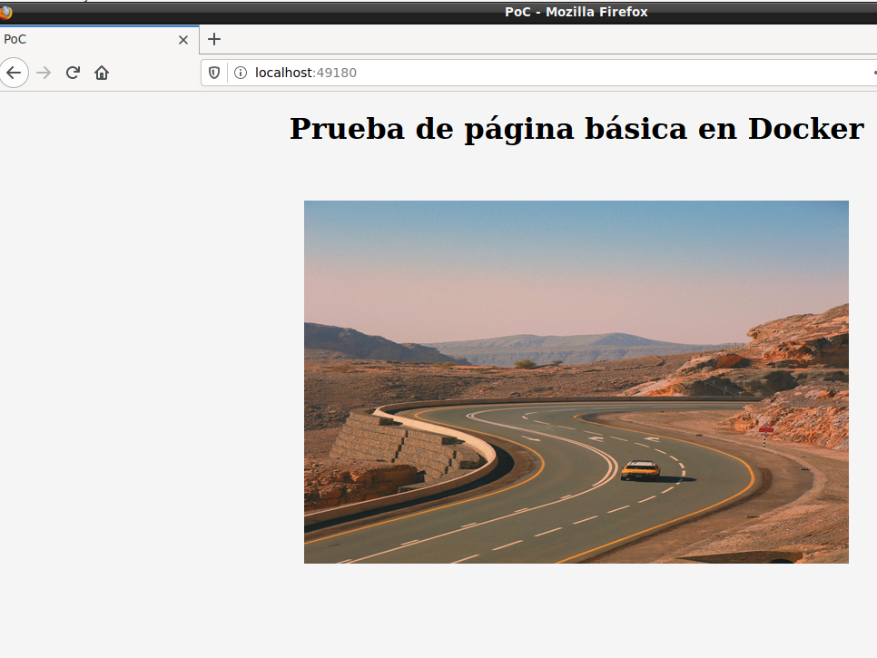

# Creación de un contenedor con un servidor apache básico
## Partes

- **1: Página de prueba**

```html
<!DOCTYPE html>
<html lang="es">
<head>
	<meta charset="UTF-8">
	<title>PoC</title>

	<style>
		body {
			width: 1200px;
			height: 700px;
			margin: 0 auto;
			background-color: #F5F5F5;
		}
		h1 {
			text-align: center;
		}
		div {
			margin: 5% 0 0 25% ;
		}
		img {
			width: 600px;
			height: 400px;
		}
	</style>
</head>
<body>
	<h1>Prueba de página básica en Docker</h1>
	<div></div>
</body>
```

- **2: Dockerfile**

```dockerfile
FROM httpd
MAINTAINER Julio Serrata
WORKDIR /usr/local/apache2/htdocs
COPY index.html ./
EXPOSE 80
```

## Pasos

- **1: Generar imagen**

```bash
docker build . -t server-apa-img
```

- **2: Generar contenedor**

```bash
docker run --name server-apache -dit -v ~/[Directorio de los archivos del servidor]/server_apache/img/:/usr/local/apache2/htdocs/img -p 49180:80 server-apa-img
```

### Resultado



### Referencias

- [Contenedor de httpd en DockerHub](https://hub.docker.com/_/httpd)
